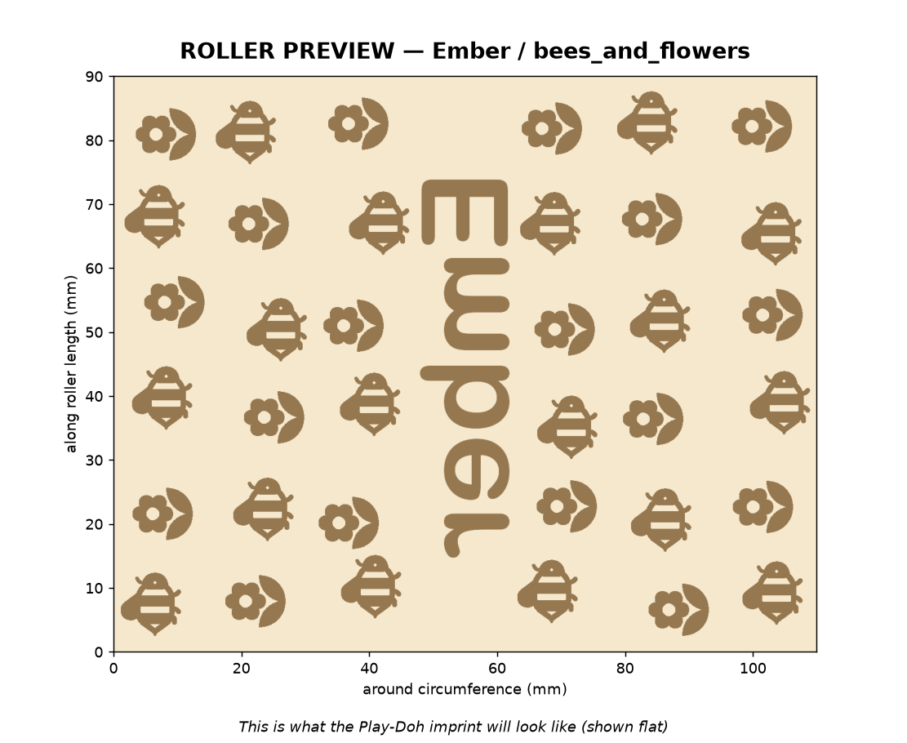
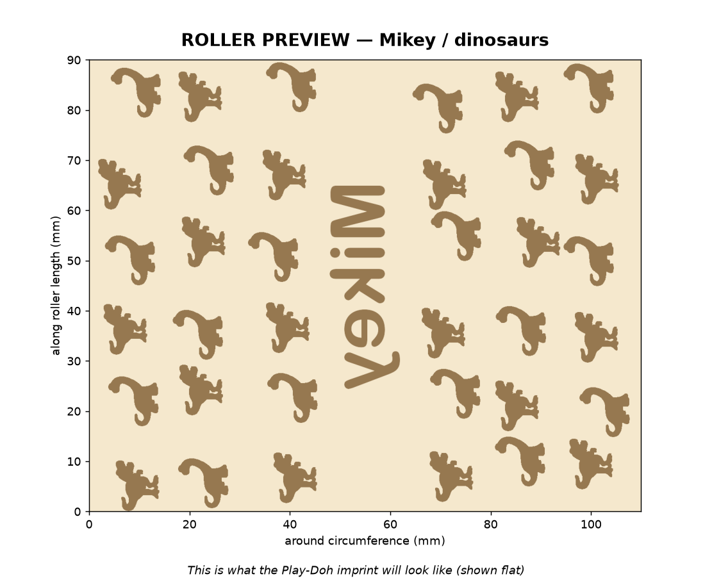
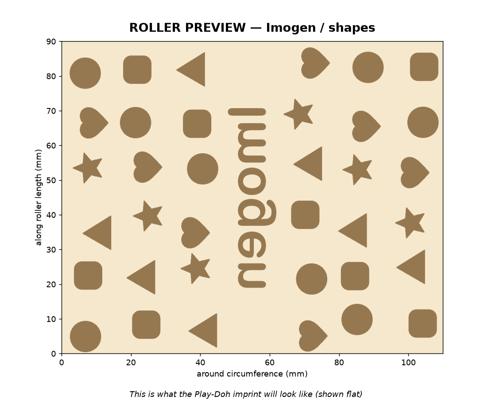

# 🎨 Play-Doh Roller Generator

Make your own **personalized Play-Doh / clay texture rollers** — a cylinder with
a kid's name embossed lengthways and a themed pattern of cute decorations
(bees & flowers, dinosaurs, shapes, cats, fruits, trucks) wrapped around it. Roll
it over Play-Doh and it stamps the name and pictures into the dough.

One small Python script produces both a **flat PNG preview** of the imprint and
a **print-ready STL**.

> ✅ **Print-verified.** The Ember / bees-and-flowers roller has been printed on
> a Bambu Lab printer (solid, upright, no handles) and came out great — crisp
> embossed name and decorations. The full pipeline (SVG icons → heightmap →
> upright STL → print) is confirmed end-to-end.

---

## Relief direction

This is the **original (v1)** roller: features stand **out** of the barrel and
press **down** into the dough, leaving an **indented** imprint. ✅ This is the
chosen, print-verified design.

> An alternative **v2** (engraved roller → *raised* dough imprint, via
> `--engrave`) was tried too, but after printing both, the original was
> preferred. The v2 files are kept under [`archive/v2/`](archive/v2) for
> reference. The `--engrave` flag still works if you ever want to regenerate it.

---

## Examples

| Ember — bees & flowers | Mikey — dinosaurs | Imogen — shapes |
|:---:|:---:|:---:|
|  |  |  |

*Previews show what the imprint looks like pressed flat into the dough (cream =
surface, dark = indentation). The name reads lengthways along the roller.*

---

## Quick start

```bash
# install dependencies (one time)
pip install trimesh numpy pillow matplotlib svgpathtools --break-system-packages

# make a preview PNG + printable STL
python playdoh_roller.py --name "Imogen" --theme shapes --preview --stl
```

Outputs are named `preview_<name>_<theme>.png` and `roller_<name>_<theme>.stl`.

> **Note:** the full collection's print-ready STLs are committed under
> [`printable_files/`](printable_files). They're large (~60 MB each), so a clone
> is hefty — or just regenerate any roller on demand with the command above.

### Options

| Flag | Default | Meaning |
|---|---|---|
| `--name` | `Ember` | Name embossed lengthways along the roller |
| `--theme` | `bees_and_flowers` | `bees_and_flowers`, `dinosaurs`, `shapes`, `cats`, `fruits`, `trucks` |
| `--preview` | – | Write the flat imprint PNG |
| `--stl` | – | Write the printable STL |
| `--radius` | `17.5` | Barrel radius in mm (35 mm diameter) |
| `--length` | `90` | Imprint length in mm |
| `--emboss` | `1.8` | How far features rise above the barrel, mm |
| `--top-stamp` | off | Raise the theme's first icon out of the **top end** → doubles as a press-stamp |
| `--stamp-relief` | `2.5` | Height of the top-end stamp icon, mm |
| `--ppm` | `12` | Heightmap resolution (px/mm); ≥10 keeps detail crisp |
| `--handles` | off | Add grip stubs at both ends (simple barrel by default) |

> 🐝 **Top-end stamp:** `--top-stamp` raises the theme's signature icon (bee /
> T-Rex / etc.) ~2.5 mm out of the roller's **up** end, so the end works as a
> cute press-stamp. The bed end stays flat. It's part of the same watertight
> solid (STL only; not shown in the flat preview).

---

## Themes

| Theme | Decorations |
|---|---|
| 🐝 `bees_and_flowers` | bee + flower |
| 🦖 `dinosaurs` | T-Rex + brontosaurus |
| ⭐ `shapes` | circle, square, triangle, star, heart |
| 🐱 `cats` | cat face + paw print |
| 🍎 `fruits` | apple + banana |
| 🚚 `trucks` | delivery truck + car |

Decorations are **real, open-licensed silhouette icons** (not hand-drawn),
rasterized from the SVGs in [`assets/`](assets) — see
[`assets/ATTRIBUTION.md`](assets/ATTRIBUTION.md) for sources & licenses. Adding a
new theme is just dropping a couple of bold SVGs in `assets/` and adding one line
to the `THEMES` dict (see [`SKILL.md`](SKILL.md)).

---

## Printing (Bambu Studio)

The STL is exported **standing upright on its end** — drop it straight on the
plate, no rotation needed.

- **Orientation:** upright (axis vertical). Every layer is a ring with the relief
  on its outer wall → **no supports, no overhangs**.
- **Layer height:** 0.15 mm ("Fine") for crisp letters; 0.2 mm works too.
- **Infill:** 40%, with 3+ walls so features are fully solid.
- **Adhesion:** Engineering plate + a **brim** (the footprint is just a Ø35 mm
  circle); slow the first layer.
- **Material:** PLA (PETG for durability).

To use it: roll the barrel over your Play-Doh by hand. 🎉

---

## What's in here

```
playdoh_roller.py     the generator (single self-contained script)
assets/               decoration SVGs + ATTRIBUTION.md
previews/             example imprint previews (PNG)
printable_files/      ready-to-slice STL/3MF files for the whole collection
SKILL.md              full reference / how it works
```

---

## How it works (short version)

1. The name (rotated to run lengthways) and the themed decorations are rendered
   into a 2D grayscale **heightmap** of the unrolled cylinder surface.
2. Decorations are placed on a seeded grid that **tiles cleanly** across the
   roll seam, alternating icons so it looks natural but repeatable.
3. For the STL, the heightmap is wrapped onto a cylinder: raised pixels push the
   surface **outward** (so they press *into* the dough), over a solid core, and
   the whole thing is stood upright for printing.

Full details — including the pure-Python SVG rasterizer (no native cairo needed)
— are in [`SKILL.md`](SKILL.md).

---

## Credits

Decoration icons from open icon sets (Game-icons.net, Google Noto Emoji,
Material Design Icons, Microsoft Fluent Emoji, Ionicons, Teenyicons) via the
[Iconify](https://iconify.design) API. Per-icon sources and licenses are listed
in [`assets/ATTRIBUTION.md`](assets/ATTRIBUTION.md).
