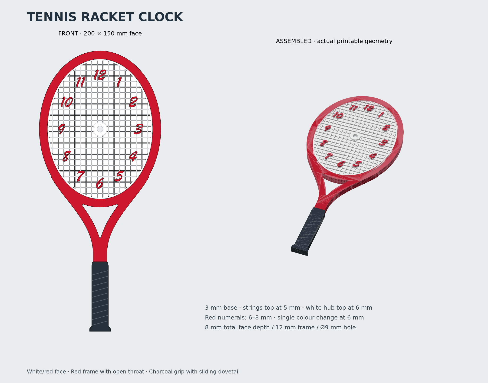

# Tennis racket clock

Three physical printed components: a white/red clock face, a red head with open throat, and a charcoal handle. The overall silhouette is 174 mm wide × 402 mm long. The revised throat uses curved shoulders and a tapered, rounded triangular opening inspired by the supplied reference. The shorter grip starts below the throat, with its connector hidden behind the neck. These are design proportions, not a replica of a specific commercial racket.



## Printable files

All files are in `printable_files/tennis_racket_clock/` and use millimetres.

| File | Use |
| --- | --- |
| `face_white_red.3mf` | One physical face, white body/strings and red numerals; two material parts |
| `face.stl` | Same face as one fused mesh; one white-to-red filament change at Z = 6 mm |
| `frame.stl` | Head and open throat; front-down on the bed |
| `handle.stl` | Handle with dovetail and shallow grip grooves; back-down on the bed |
| `face_white_material.stl`, `face_red_material.stl` | Alternative multipart import; load together as parts of one object, retain relative coordinates, assign white/red |
| `validation.json` | Generated dimensions, mesh volumes and validation results |

The two material STLs are alternatives to the face 3MF, not additional physical assembly parts. Never drop the red material to the bed separately. STL cannot encode filament colour. The 3MF includes standard white/red materials and Bambu-style extruder assignments; confirm the white and red spool assignments in your slicer. This package has not been tested in a slicer.

## Dimensions and fits

- Face: 150 × 200 mm oval, 3 mm solid body, strings from Z = 3–5 mm, and red numerals from Z = 6–8 mm: 8 mm total face thickness. White numeral-shaped supports extend through the string layer to Z = 6 mm, so the red numerals print on solid material without bridging. String lines are 1.1 mm wide on an 8 mm pitch. The grid is continuous under the numbers and merges into the round central hub; there are no clearance gaps around the numbers.
- Through-hole: 9 mm diameter through a 20 mm-diameter white circular hub. The hub top is at Z = 6 mm, 1 mm above the strings.
- Numbers 1–12: Brush Script Italic, 15 mm visual height, red. This is an approximate script aesthetic inspired by Wilson lettering, not an official Wilson font. The installed Windows font is converted into geometry; the font file is not redistributed.
- Frame: 12 mm deep, with a 12 mm-wide band around the oval. Both curved throat arms are also 12 mm wide in top view, swept at constant width and blended into the head and neck with rounded junctions. Its front is flush with the face body. The back of the face sits 9 mm forward of the frame back; the raised pattern projects 2 mm ahead of the frame front.
- Face locating flange: 2 mm outward and 1.5 mm deep, contained within the 3 mm face body, making the hidden flange 154 × 204 mm. It seats in a matching stepped recess at the back of the frame, with 0.30 mm clearance per side. The flange contacts the underside of the frame step to stop forward travel.
- Handle: 99.5 mm visible grip, 115 mm including its hidden tongue, 12 mm thick, up to 30 mm wide. A 7.75 mm-deep dovetail enters an 8 mm-deep rear socket, with 0.25 mm clearance per side and in depth. A 4 mm front skin conceals the joint beneath the throat. The shoulder has a 0.5 mm assembly gap. Glue retains both joints; they are not snap-fits.
- Frame print footprint: approximately 174 × 302 mm. The extended throat requires a larger bed than the original design. Allow extra bed margin for skirts/brims and printer exclusion zones. Face: 154 × 204 mm. Handle: 30 × 115 mm.

## Single colour change

For a single-extruder printer, slice `face.stl` in white. Insert one filament change after completing Z = 6.0 mm, before the first layer above that height (at 0.2 mm uniform layers, before the layer ending at 6.2 mm). Print all remaining layers red. Only the numerals occupy Z > 6 mm. The white hub and all strings finish before this colour change. The two-colour 3MF provides the same height-separated material regions.

## Print and assemble

1. Import each physical component separately. The exported STLs are already bed-oriented. Print the face with its back flat and the raised features upward, the frame front-down, and the handle back-down. The face flange starts on the bed and needs no overhang support. The frame's stepped recess opens upward.
2. Use 0.2 mm layers and at least four walls as a starting point. For the requested physically solid face, set 100% infill. The thin face uses substantially less material than the original 30 mm version. Lower infill changes the literal solid requirement. Choose frame/handle infill appropriate to the intended mounting.
3. Dry-fit the face into the frame from the back until its flange seats. Align 12 toward the racket tip. Adjust for your printer's dimensional calibration before bonding: the CAD clearances cannot guarantee a perfect fit on every machine. Deburr or lightly sand the mating edges as needed.
4. Insert the handle dovetail into the frame socket from the back, aligning both front surfaces. The socket is closed at the front and cannot accept the tongue from that side. Bond the joint and the face locating flange with an adhesive compatible with your filament. Support the joint while it cures.
5. Install a clock movement through the 9 mm hole from the back. The mounting stack is **6 mm through the raised centre hub plus the movement's washer and retaining nut**. Confirm that the movement supports that panel thickness before printing; no rear mechanism pocket is included. The hand hub must put the lowest hand above the numeral tops at Z = 8 mm, with additional running clearance. The hub is 1 mm above the strings but the numerals are another 2 mm above the hub; the hub alone does not guarantee hand clearance. Keep rotating hands within the face opening (a sweep radius below roughly 70 mm allows margin at the narrow sides).

Clock movement, hands, hardware and wall mounting are not included. No mechanism dimensions beyond the requested 9 mm shaft hole were supplied. Choose a mounting method that supports the assembled weight.

## Regenerate

Use Python 3.12+ and install `tennis_racket_clock_requirements.txt`, then run:

```sh
python tennis_racket_clock.py
python tennis_racket_clock.py --font /path/to/your/script-font.ttf
python tennis_racket_clock.py --config clock-settings.json
```

The optional JSON keys are the fields of `ClockConfig` in `tennis_racket_clock.py`. Default dimensions and the selected font are recorded in `validation.json`. Preview layout labels describe the default 200 mm design.

Generation checks watertightness, consistent winding, positive volume and one connected mesh per physical component. It also checks assembled part collisions, the clear through-hole, the dovetail clearance, the non-overlapping colour bodies, and reopens exported STLs/3MF to check mesh integrity and colour structure. These are digital checks; no physical test print has been made.


